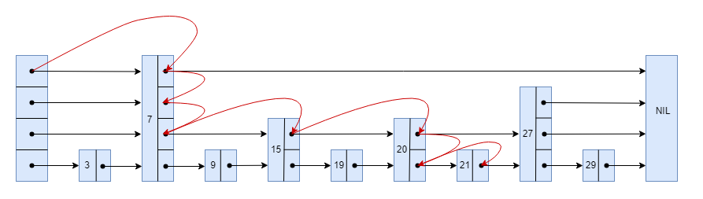

# 跳表
跳表(Skip List)是由*William Pugh*发明的一种用于快速查找的随机化数据结构。其结构建立在链表的基础上，通过额外存储多级索引的方式，用空间换时间，使其插入、删除、查找的期望时间复杂度都为 $O(log \ n)$ ，其效率可以比拟二叉查找树。

## 基本概念
跳表本质上是对有序链表的一种改进，由并联的链表组成。

为方便讨论，后续所有链表默认以**升序**排列。

对一个有序链表的查找，就是从链表头开始遍历，直到当前节点的值大于或者等于目标值。很明显，这个查找的时间复杂度是 $O(n)$ 。

跳表在有序链表的基础上，引入了分层的概念。首先，跳表的每层都是一个有序链表，最底层是初始的有序链表，每个位于第 $i$ 层的节点有 $p$ 的概率出现在第 $i+1$ 层， $p$ 为常数。

记在 $n$ 个节点的跳表中，期望包含 $\frac{1}{p}$ 个元素的层为第 $L(n)$ 层，则 $L(n)=log \frac {1}{p} n$ 。

在跳表中查找，就是从第 $L(n)$ 层开始，水平的逐个比较直到当前节点的下一个节点大于等于目标节点，然后移动到下一层的当前节点。重复这个过程直到达到第一层且无法继续进行操作。此时，若下一个节点是目标节点，则查找成功；反之，则目标节点不存在。这样一来，查找的过程中会跳过一些没必要的比较，所以相比有序链表的查找，跳表的查找更快。假设在由`3,7,9,15,19,20,21,27,29`序列组成的跳表中，查找`21`的过程如下图所示:

## 复杂度证明
### 空间复杂度
跳表对空间的消耗主要体现在每个节点的最大层数上。对于一个节点而言，最高层数为 $i$ 的概率为 $p^{i-1}(1-p)$ ，所以跳表的期望层数为 $\sum_{i \geq 1} ip^{i-1} (1-p) = \frac {1}{1-p}$ 。而因为 $p$ 是常数，所以跳表的**期望空间复杂度**为 $O(n)$ 。

### 时间复杂度
跳表对时间的消耗主要体现在层高为 $i$ 时的平均搜索路径长度。我们反向分析搜索路径，即从搜索路径的终点开始向起点反向推导。

假设当前处于一个第 $i$ 层的节点 $x$ ，我们并不知道 $x$ 的最大层数和 $x$ 左侧节点的最大层数，只知道 $x$ 的最大层数至少为 $i$ 。那么其搜索路径上只有两种情况。如果 $x$ 的最大层数大于 $i$ ，那么下一步应该向上走，即搜索路径增加，层数下降，这种情况的概率为 $p$ ；如果 $x$ 的最大层数等于 $i$ ，那么下一步应该向左走，即搜索路径增加，层数不变，这种情况的概率为 $1-p$ 。

令 $C(i)$ 为在一个无限长度的跳表中向上爬 $i$ 层的期望代价，那么有:
$$C(0)=0$$
$$C(i)=(1-p)(1+C(i))+p(1+C(i-1))$$

解得 $C(i)= \frac {i}{p}$ 。

由此得出，在长度为 $n$ 的跳表中，从底层到 $L(n)$ 层的期望步数存在上界 $\frac {L(n)-1}{p}$ 。

现在只需要分析爬到 $L(n)$ 层后还需要再走多少步。显然，到达 $L(n)$ 层后，向左走的步数不会超过 $L(n)$ 层及更高层的节点数总和，其期望为 $\frac {1}{p}$ 。所以到达 $L(n)$ 层后向左走的期望步数存在上界 $\frac {1}{p}$ 。同理，到达 $L(n)$ 层后向上走的期望步数存在上界 $\frac {1}{p}$ 。

所以，跳表查询的期望步数为 $\frac {L(n)-1}{p} + \frac {2}{p}$ ，又因为 $L(n)=log_ \frac {1}{p}n$ ，所以跳表查询的**期望时间复杂度**为 $O(log \ n)$ 。

插入和删除操作就是进行一遍查询，途中记录需要修改的节点，最后修改完成。显然每层至多只需要修改一个节点，所以插入和删除的**期望时间复杂度**也为 $O(log \ n)$ 。

## 跳表的随机访问优化
访问跳表中第 $k$ 个节点，相当于访问初始有序链表中的第 $k$ 个节点，很明显其时间复杂度是 $O(n)$ 。

跳表的随机访问优化，只需要对跳表中的每个前向指针，再多维护一份该指针的长度。假设 $A$ 和 $B$ 都是跳表中的节点，其中 $A$ 为跳表的第 $a$ 个节点， $B$ 为跳表的第 $b$ 个节点，且在跳表的某一层中 $A$ 的前向指针指向 $B$ ，那么这个前向指针的长度为 $b-a$ 。

现在访问跳表中的第 $k$ 个节点，就可以从顶层开始水平遍历该层链表，直到当前节点的位置加上当前节点在该层的前向指针长度大于等于 $k$ ，然后移动至下一层。重复这个过程直至到达第一层且无法继续操作。此时，当前节点就是跳表中第 $k$ 个节点。

这样，就可以快速访问到跳表的第 $k$ 个元素。这个操作的时间复杂度为 $O(log \ n)$ 。
