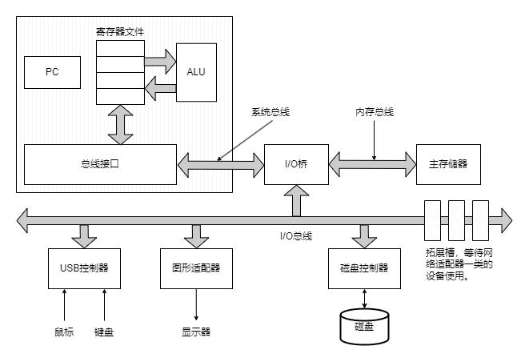
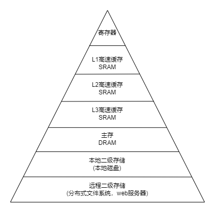

# 01. 计算机系统漫游

## 1.1 信息就是位+上下文
源程序实际上就是由0和1组成的位(又称比特)序列，8位组成一个字节，每个字节表示程序中的某个文本字符。只由ASCII构成的文件称为文本文件，其他所有文件都是二进制文件。

系统中的所有信息，包括磁盘文件、内存中的程序、内存中存放的数据和网络传输的数据，都是由一串比特组成的。区分这些不同数据对象的唯一方法是根据读到这些数据对象时的上下文(context)。在不同的上下文中，一个同样的字节序列可能表示一个整数、浮点数、字符串或机器指令。

## 1.2 编译系统是如何工作的
为了在操作系统上运行一个高级语言程序，程序的每条语句都必须被转化为一系列低级的机器语言指令。然后将这些指令按照可执行目标程序的格式打包，并以二进制磁盘文件的形式存放。在Unix系统上，这个过程是由编译器驱动程序完成的。

将源文件翻译成可执行目标文件，分为四个阶段完成，分别是预处理器、编译器、汇编器、链接器，它们一起构成了编译系统。

- 预处理阶段。 预处理器修改原始程序，读取其依赖的头文件，并直接插入程序文本中。
- 编译阶段。 编译器将预处理后的文本文件翻译成汇编语言程序。
- 汇编阶段。 汇编器将汇编语言程序翻译成机器语言指令，并将指令打包成可重定位目标程序的格式，将结果保存在.o文件中。
- 链接阶段。 链接器负责合并程序所依赖的库文件(.o)，得到一个可执行目标文件。

## 1.3 处理器是如何工作的
典型系统的硬件组织由如下几部分构成。
1. 总线
贯穿整个系统的是一组电子管道，称为总线，它携带信息字节并负责在各个部件间传递。通常被设计成传送定长的字节快，64位操作系统普遍为8字节。
2. I/O设备
I/O设备是系统与外部世界的联系通道。如鼠标、键盘、显示器、磁盘等。每个I/O设备都通过一个控制器或适配器与I/O总线相连，用于在I/O总线和I/O设备之间传递信息
3. 主存
主存是一个临时存储设备，在处理器执行程序时，用来存放程序和程序处理的数据。从物理上来说，是由一组动态随机存取存储器芯片组成的。从逻辑上来说，存储器是一个线性的字节数组，每个字节有唯一的地址。
4. 处理器
中央处理单元(CPU)，简称处理器。是执行存储在主存中指令的引擎。其核心是一个大小为一个字节快的存储设备(寄存器)，称为程序计数器(PC)。在任何时刻，PC都指向主存中的某条机器语言指令。

处理器从PC指向的内存处读取指令，执行该指令，然后更新PC，使其指向下一条指令，这条指令不一定在内存中和刚刚执行的指令相邻。

这样的操作围绕着主存、寄存器文件和算数/逻辑单元(ALU)进行。寄存器文件是一个小的存储设备，由寄存器组成。ALU计算新的数据和地址值。下面是一些简单操作的例子，CPU在指令的要求下可能会执行这些操作。
- 加载。 从主存复制一个字到寄存器，覆盖寄存器原来的内容。
- 存储。 从寄存器复制一个字到主存的某个位置上，覆盖这个位置原来的内容。
- 操作。 把两个寄存器的内容复制到ALU，ALU对其做算术运算，并将结果存放到一个寄存器中，覆盖寄存器原来的内容。
- 跳转。 从指令本身抽取一个字，并将这个字复制到PC中，覆盖PC中原来的值。

当运行一个可执行文件时，磁盘上的可执行文件通过I/O桥加载到主存储器，处理器执行程序中的机器语言指令，将数据字节从主存复制到寄存器文件，再从寄存器文件复制到显示设备，最终显示在屏幕上。

## 1.4 高速缓存
观察运行一个可执行文件时的流程，发现系统花费了大量时间把信息从一个地方挪到另一个地方。最初程序的机器指令放在磁盘，加载时被复制到主存，处理器运行程序时，指令又从主存复制到处理器。这些复制就是开销，减慢了工作效率。

根据机械原理，较大的存储设备比较小的存储设备运行的慢，但造价低。处理器从寄存器文件中读数据要比从主存中读取快上百倍。针对这种差异，系统设计者采用了更小更快的存储设备，称为高速缓存(cache)，作为暂时的集结区，存放处理器近期可能需要的信息。利用高速缓存的局部性原理，即程序具有访问局部区域里的数据和代码的趋势，让高速缓存中存放可能经常访问的数据，大部分的内存操作都能在高速缓存中完成。利用高速缓存，能将程序的性能提高一个数量级。

## 1.5 存储器层次结构
存储器层次结构的主要思想是上一层的存储器作为低一层存储器的高速缓存。因此，寄存器文件就是L1的高速缓存，L1是L2的高速缓存，L2是L3的高速缓存，L3是主存的高速缓存，主存是磁盘的高速缓存。

## 1.6 操作系统管理硬件
我们可以把操作系统看成是应用程序和硬件之间的一层软件，所有应用程序对硬件的操作都必须通过操作系统。

操作系统有两个基本功能：
1. 防止硬件被失控的应用程序滥用。
2. 向应用程序提供简单一致的机制来控制复杂的低级硬件设备。

操作系统通过几个基本的抽象概念：进程、虚拟内存和文件来实现这两个功能。

其中，文件是对I/O设备的抽象，虚拟内存是对主存和磁盘I/O设备的抽象，进程则是对处理器、主存和I/O设备的抽象。

### 进程
进程是操作系统对一个正在运行的程序的一种抽象，在一个系统上可以同时运行多个进程，而每个进程都好像在独占的使用硬件。这是操作系统通过并发的方式，使处理器在进程间来回切换实现的。这种交错执行的机制称为上下文切换。

操作系统保持跟踪进程运行所需的所有状态信息，这种状态就是上下文，包括许多信息，如PC和寄存器文件的当前值以及主存的内容。在任一时刻，单处理器只能执行一个进程的代码。当操作系统决定要把控制权从当前进程转移到某个新进程时，就会进行上下文切换，即保存当前进程的上下文，恢复新进程的上下文，然后将控制权传递到新进程，新进程就会从它上次停止的地方开始。

### 线程
一个进程实际上可以由多个称为线程的执行单元组成，每个线程都运行在进程的上下文中，共享同样的代码和全局数据。

### 虚拟内存
虚拟内存是一个抽象概念，它为每个进程提供了一个假象，即每个进程都在独占的使用主存。每个进程看到的内存都是一致的，称为虚拟地址空间。也就是说，程序所访问的地址并不是实际的物理地址，而是一个虚拟地址，处理器通过一个中间层(内存管理单元MMU)将虚拟地址转换位物理地址，以访问真实的主存地址空间。进程的虚拟地址空间由低地址到高地址分别由如下几部分组成：
- 程序代码和数据。 对所有进程来说，代码是从同一固定地址开始的，直接按照可执行目标文件的内容初始化的。
- 堆。 代码和数据区后是运行时堆，代码和数据在进程开始运行时就被指定了大小，而堆内存可以在运行时动态的扩展和收缩。
- 共享库。 共享库的代码和数据区域。
- 栈。 用户栈区域，编译器用它来实现函数调用。和堆一样，用户栈在程序执行期间可以动态的扩展和收缩。每调用一个函数，栈就会增长；从一个函数返回，栈就会收缩。
- 内核虚拟内存。 地址空间顶部是内核保留的区域。不允许应用程序读写这个区域的内容或直接调用内核定义的函数。它们必须调用内核来执行这些操作。

### 文件
文件就是字节序列。每个I/O设备，包括磁盘、键盘、显示器，甚至网络，都可以看成文件。