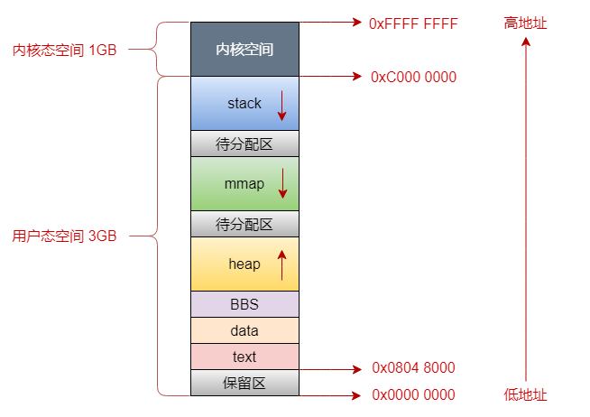
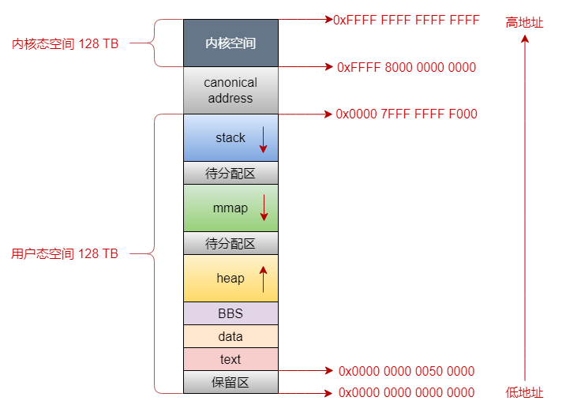

# 理解glibc malloc()原理

现在开源社区中存在很多种内存分配器，如dlmalloc，ptmalloc2，jemalloc，tcmalloc，libumem等。在本文中仅讨论glibc malloc使用的内存分配器ptmalloc2。

在早期Linuxx系统里，使用dlmalloc做为默认的内存分配器。而ptmalloc2来自于dlmalloc的分支，并在其基础上添加了线程支持，成为了现代Linux系统默认的内存分配器集成到glibc中。

## 内存布局

在32位和64位操作系统中，内存布局是不同的。在描述详细的内存布局前，先了解几个基本概念：
- 栈区（stack）： 存储程序执行期间的局部变量和函数参数，从高地址向低地址增长。
- 文件映射区（mmap）： 将文件或对象映射到进程的地址空间，动态链接库加载到此处。
- 堆区（heap）： 动态内存分配区，通过malloc，free等方式管理。
- 未初始化变量区（BSS）： 存储未被初始化的全局变量和静态变量。
- 数据区（data）： 存储有预定义的得全局变量和静态变量。
- 代码区（text）： 存储只读的程序代码段和机器指令。

### 32位机器上内存空间分布

#### 经典布局

在32位操作系统中，指针的寻址范围是 $2^{32}$ ，所表达的虚拟内存空间为 4 GB。

其中，内核态虚拟内存空间为 1 GB，用户态虚拟内存空间为 3 GB。其具体内存布局如下图：

其中，0x0000 0000到0x0804 8000这段虚拟内存地址是不可访问的保留区，被大多数操作系统认为不是一个合法的地址，不允许访问。

保留区上边就是text和data段，它们是从程序的二进制文件中直接加载到内存中的。BSS中的数据也存在二进制文件中，但因为它们是没有初值的，所以只会记录大小，加载进内存时生成一段 0 填充。

再上边就是heap空间，红色箭头表示其空间地址的增长方向是从低地址到高地址的。内核中，使用start_brk标识heap的起始位置，brk表示结束位置。当申请新的内存空间时，只需要将brk指针增加对应的大小，回收时减少对应的大小即可。

接下来就是mmap空间，它是从高地址向低地址增长的。进程运行时所依赖的动态链接库中的text，data，BBS段就加载在此处；另外映射的地址空间也保存在这个空间。

然后就是stack空间，它是从高地址向低地址增长的。内核中使用start_stack标识stack的起始位置，RSP寄存器中保存栈顶指针，RBP寄存器中保存栈基地址。通常情况下，Linux系统的stack size被限制在 8192 KB，可以通过`ulimit -a`查看，`ulimit -s`修改。

最后就是内核空间了，用户进程不允许直接访问内核空间。

观察heap和nnmap增长方向，会发现它们是相对增长。这意味着它们可增长的虚拟内存空间会互相影响，而32位操作系统能提供的虚拟空间地址是有限的，所以内核引入了另外一种内存布局。但对于64位操作系统，因为其提供了足够大的虚拟内存空间，所以往往采用此种布局。

#### 默认布局

为了解决上述内存布局的空间局限性，引入了如下内存布局：

可以看到，这种内存布局，通过修改nnmap为向上增长的方式，增大了nnmap和heap的可用虚拟内存地址空间。

### 64位机器上内存空间分布

在64位操作系统中，指针的寻址范围是$2^{64}$，所表达的虚拟内存空间为 16 EB。实际情况中根本不会用到这么大范围的内存空间，所以目前64位操作系统只使用了48位来描述虚拟内存空间，寻址范围为$2^{48}$，所表达的虚拟空间内存为 256 TB。

其内存布局如下：

其中，canonical address为空洞区域，是不可访问的内存空间。

另外，观察内核空间和用户空间，可以发现，内核空间的高16位全部位0，而用户空间的高16位全部位1。以此可以快速判断一个虚拟地址空间属于用户空间还是内核空间，反之，则是处于空洞区域中，肯定是非法访问了。

实际上，在text和data之间，还有一段不可读写的保护段，用于防止程序在读写时越界访问到代码段。访问该保护段会直接引起`SIGSEGV`信号中断，防止程序继续向下执行。

## 内存分配

根据上文所述，heap和mmap区域是可以供用户程序使用的虚拟内存空间，操作系统提供了相应的系统调用来完成分配内存的工作。

- heap：系统提供`brk()`函数，C提供`sbrk()`库函数。
- mmap：系统提供`mmap()`和`munmap()`函数。

实际上，`malloc()`并不是系统调用，而是进行了二次封装。其本质就是通过`brk()`和`mmap()`两种系统调用方式，以完成分配内存的。

那么`brk()`和`mmap()`有什么差异呢？`malloc()`何时使用`brk()`，何时使用`mmap()`呢？我们接下来详细分析两种系统提供的申请内存函数的作用和差异。

### brk

使用`brk()`申请的内存处于heap区，其内存申请的方式并不是严格按照所需的内存空间申请的，而是会预申请比实际申请的更多的内存空间。而且在通过`free()`释放时，也不会把该内存空间归还给操作系统，而是等到进程结束后，由操作系统回收资源。

这种方式是为了提高内存申请的效率，因为向操作系统申请内存空间是要从用户态进入到内核态的，这对进程来说是一种开销。所以预申请更多的内存空间，可以减少系统调用的次数，降低开销。在释放时不会将内存空间归还给操作系统也是同理。当进程释放内存空间后，该内存空间由malloc内存池管理，当进程再次申请内存时，可以直接从malloc内存池分配，避免了系统调用的开销。

既然使用`brk()`能带来更少的开销，为什么不全部使用`brk()`申请内存空间呢？

由于`brk()`是通过移动堆顶的位置来分配内存，并且申请的内存不会立即归还给操作系统。在进程长时间频繁通过`brk()`申请和释放内存后，如果高地址的内存不释放，低地址的内存也得不到释放。这显然会在heap区内产生内存碎片。

所以，因为`brk()`不可避免的会产生内存碎片，不能全部使用它申请内存。在申请大块内存空间时，就会使用`mmap()`的方式申请和释放。

### mmap

使用`mmap()`申请的内存处于mmap区，其通过将文件磁盘地址映射到虚拟内存地址的方式分配内存，并由操作系统自动回写脏页面到磁盘上。而且，使用该方法申请的内存在`free()`后会直接归还给操作系统。

显然，通过`mmap()`申请和释放的内存空间，每次都要从用户态进入内核态，需要频繁的系统调用，这明显造成了额外的开销。但其不会产生内存碎片，更适用于提供大块内存的申请和释放。

### 结论

在`malloc()`申请内存时，实际上是通过要申请的内存大小，来决定使用`brk()`还是`mmap()`。一般的分配阈值是 128 KB，小于 128 KB的内存申请调用`brk()`，多余 128 KB的内存申请调用`mmap()`。

在了解`malloc()`是如何使用系统调用的以后，我们再从Arena，Bin，Chunk三个方面，分析`malloc()`内部的实现原理。

## malloc实现原理

接下来，我们从arena，bin，chunk三部分来理解`malloc()`对内存分配与回收的过程。

### arena

arena是通过`brk()`或者`mmap()`系统调用为线程分配的堆内存区域，按线程的类型区分为main arena和thread arena两类。

#### main arena

main arena是由主线程创建的，其内存分配流程如下：

#### thread arena

thread arena是由子线程创建的，其内存分配流程如下：

这里要注意，arena和线程并不是一一映射的关系，实际上arena的数量取决于系统CPU核数，在64位操作系统中，往往是`8 * number of cores`。

所以，多个线程共享同一个arena的现象是存在的，其通过锁的方式来保证线程安全。当线程调用`malloc()`申请内存时，会遍历寻找可用的arena并其尝试加锁，加锁失败则`malloc()`被阻塞，直到arena可用为止。

### bin

bin是管理chunk的数据结构，是以free chunk为节点组成的链表（关于free chunk的原理将在下文中详细介绍）。针对不同大小的free chunk，bin被分为fast bin，unsorted bin，small bin，large bin四种类型。

#### fast bin

fast bin是由fast chunk组成的单链表，其中fast chunk指大小为 16 ~ 80 字节的chunk。在所有的bin类型中，fast bin具备最快内存分配和释放速度。

- fast bin共有 10 个。

- 每个都维护一个单链表，只是用fd指针，采用LIFO(后入先出)的方式，添加和删除操作都直接对链表头操作。

- fast bin管理的chunk大小是8字节递增的。即`fast bin[0]`维护大小为 16 字节的chunk，`fast bin[1]`维护大小为24字节的chunk，以此类推。

- 在一个fast bin链表中，所有chunk的大小相同。

- 在fast bin中的相邻的chunk不会被合并，虽然这样可能会导致更多的内存碎片，但加快了内存释放的速度。

- fast bin在开始时是空的。也就是说，在首次执行`malloc()`时，即使申请的内存大小落在fast bin的内存范围内，也不会由fast bin处理，而是向下传递交给small bin处理。

- 在首次执行`malloc()`时，会执行`_init_malloc()`，此时会发现fast bin和small bin都为空，所以调用`malloc_consolidate()`进行初始化，该动作会先初始化除了fast bin以外所有的bin，最后初始化fast bin。然后当再次执行`malloc()`时，就可以使用fast bin了，系统将该chunk从对应的fast bin中删除，将地址返回给应用进程。

- 在执行`free()`时，根据chunk获取该chunk所属的fast bin，直接将其添加进链表中即可。

#### unsorted bin

unsorted bin是由free chunk组成的循环双向链表，其对chunk的大小并无限制。

- unsorted bin只有 1 个。

- 当small chunk和large chunk释放时，不会被添加到各自的bin中，而是被添加到unsorted bin中，可以理解为是small bin和large bin的缓存。这是为了可以使malloc重新使用最近释放的chunk，从而消除寻找合适bin的时间开销，增加了内存分配的效率。

- 当进行内存分配时，如果在fast bin和small bin中都没找到合适的chunk，就会将unsorted bin中的chunk转移到small bin和large bin中。

#### small bin

small bin是由small chunk组成的循环双链表，其中small chunk指小于 512 字节的chunk。

- small bin共有 62 个。

- small bin维护的chunk也是 8 字节递增。即`small bin[0]`维护 16 字节的chunk，`small bin[1]`维护 24 字节的chunk，以此类推。

- 在一个small bin中，所有的chunk大小相同。

- 在small bin中，相邻的free chunk会被合并，减少了内存碎片的产生，也减慢了释放的速度。

- small bin在开始时也是空的。在首次执行`malloc()`时，即使进程申请的内存大小落在small bin的内存范围内，也是交由unsorted bin处理，直到其初始化完成。另外，如果unsorted bin也无法满足要求，则继续在large bin中查找，若依旧不满足，则使用top chunk，若top chunk也不满足，就扩充top chunk令其满足。

- 在执行`free()`时，会检查该chunk和相邻的chunk是否可以合并，然后将其从small bin中移除，添加到unsorted bin中。

#### large bin

large bin是由large chunk组成的循环双链表，其中large chunk指大于 512 字节的chunk。

- large bin共有 63 个。

- 与前面不同的是，在一个large bin中，其维护的chunk大小可以不同，而是处在一个区间内。在63个large bin中，前32个chunk以 64 字节递增，即`large chunk[0]`维护大小为 512 ~ 575 字节的chunk，`large chunk[1]`维护大小为 576 ~ 639 字节chunk。在32个chunk后的16个bin则以 4096 字节递增，再后的4个chunk以 32768 字节递增，剩下的所有chunk则放在最后一个large bin中。

- 因为一个large bin中所有的chunk不一定相同，所以会将其按照chunk的大小排列，以加快内存分配和释放的速度。

- 在一个large bin中，相邻的free chunk也会被合并。

- large bin在执行`malloc()`时，基本类似于small bin。额外要说的是，在large bin中查找时符合需求的chunk时，因为其chunk是有序的，所以只要通过每个large bin的chunk最大值，就可以判断该large bin是否能满足需求。若找到满足需求的large bin，则遍历找到第一个满足需求的chunk，若该chunk大于申请的内存空间，则将其拆分，一部分返回给用户进程，另一部分加入到unsorted bin中。

- 另外，由于large bin的个数较多，glibc设计了Binmap用于记录各个bin中是否为空，检索过程中会跳过空的bin以增加检索速度。

### chunk

chunk是glibc内存管理的最小单位。其总共分为四类：

- allocated chunk：已经分配给用户进程，正在被使用的内存段。
- free chunk：被用户进程释放，处于空闲的内存段。
- top chunk：当前已分配内存块的最高地址处，可以快速追踪确定可用的内存范围。
- last remainder chunk：内存分配过程中最后剩余的小块未分配内存，用于减少内存碎片和提高内存利用率。

接下来，我们分别讨论每种类型的原理和用途。

#### allocated chunk

对于allocated chunk，其数据结构如下：

- prev_size：如果前一个是free chunk，则保存前一个chunk大小。如果前一个是allocated chunk，则保存用户数据大小。

- chunk_size：因为每个chunk的大小是8的整数倍，因此chunk_size的后三位是无用的。为了高效利用内存，其后三位作为标志位，其中P用于表示chunk是否位allocated chunk。M用于表示该chunk是否通过系统调用申请的，如果是，该chunk不再由后续介绍的内存管理数据结构来标记，可以简化申请和释放的流程。N用于表示该chunk是否属于主分分配区，关于该部分，将在下文中详细介绍。

- padding：用于内存对齐，保证chunk是8的整数倍。

#### free chunk

对于free chunk，其数据结构如下：

- fd：指向当前chunk在同一个bin的下一个chunk的指针。
- bk：指向当前chunk在同一个bin的上一个chunk的指针。

#### top chunk

当一个chunk处于一个arena的最顶部，即内存最高地址处，称之为top chunk。该chunk不属于任何bin。若当前所有的free chunk都无法满足应用进程申请的内存大小时，如果top chunk满足要求，则将其拆分为二，一部分用于给应用进程分配内存，余下的部分作为新的top chunk；否则，就需要扩展堆内存空间，使用系统调用申请新的内存空间了。

#### last remainder chunk

