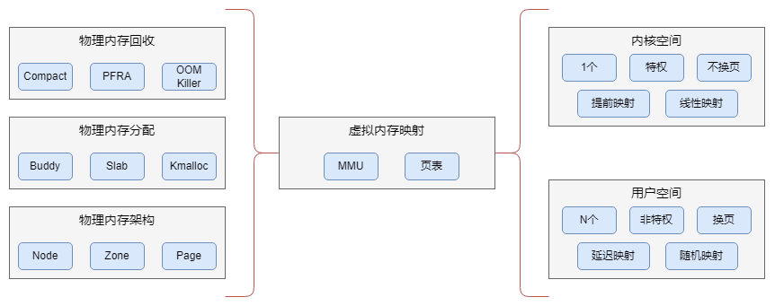
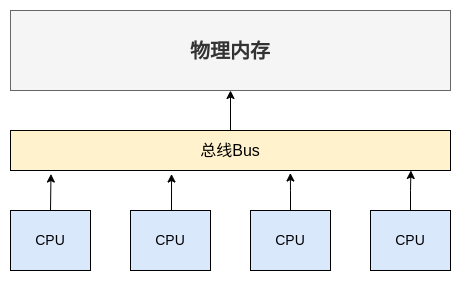
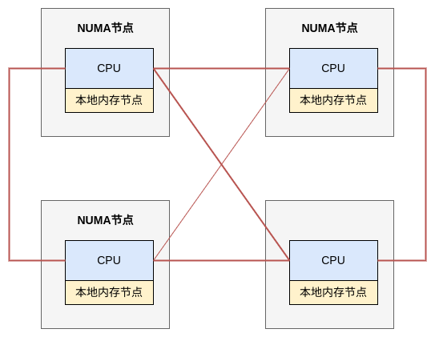

# Linux内存管理
在现代操作系统中，物理内存依然是计算机中宝贵的资源。

Linux的内存管理是内核中最为复杂的任务之一，本文将从物理内存和虚拟内存两部分入手，深入分析和理解Linux内存管理系统的原理。

## 内存管理概览
磁盘是程序存储的地方，内存是程序运行的地方。只有实现一个完善的内存管理机制，才能让进程更高效的运行。

### 内存管理模式
随着操作系统的发展，内存管理模式也经历了几代变更。其发展分为如下几个阶段。

- 原始内存管理

    最初的内存管理是非常简陋的。内核和进程运行在同一空间中。操作系统使用位图存储管理或链表存储管理的方式管理可用的内存空间；使用首次适应算法、最佳适应算法等内存分配算法为进程分配内存空间。这种管理方式的问题很明显。内核与进程没有隔离和权限区分，进程可以随意访问内核数据，也可以随意做一些危险操作。而且当物理内存较少时，能同时运行的进程也比较少。

- 分段内存管理

    分段内存管理，把物理内存分成多个段，每个段都有基地址和长度，段类型和权限。基地址和长度确定了有效范围，防止内存越界。类型则分为代码段和数据段。其中代码段是可执行的二进制文件，是只读的。而数据段又分为只读数据段和读写数据段。权限则分为了内核权限和用户权限。内核的代码段和数据段都设置为内核权限，用户进程的则设置为用户权限。

    至此，分段内存管理解决了原始内存管理的大部分问题。实现了进程与内核的隔离；提高了内存访问的安全性。但却带来了新的问题，产生过多的内存碎片，并且内存交换的效率低，而且还存在物理内存较小，无法容纳程序执行的可能。

- 分页内存管理

    分页内存管理是现代操作系统使用的内存管理模式。它提出了虚拟内存的概念，把物理内存和虚拟内存切分为一段段固定尺寸的空间，称虚拟内存段为页，物理内存段为帧。Linux下通常每页大小为 4 KB。

    并且，CPU访问任何物理内存都要通过虚拟页。所以CPU中存在一个内存管理单元(MMU)，CPU把虚拟页发送给MMU，然后由MMU负责把虚拟页转化为物理帧，再去访问实际物理内存。这个过程需要页表的支持，页表由内核负责创建和维护，存储在MMU上。

    每个进程都有独占的虚拟内存空间，页表用来描述虚拟页到物理帧的映射关系。多进程运行时，通过在不同的页表上切换，以提供真实的物理内存地址供CPU访问。并且因为每个进程只能访问自己的虚拟地址空间，这样就实现了进程与内核隔离。

    同时，分页的方式使得在加载程序时，不需要一次性把程序都加载到物理内存中。而是在程序运行时，真正访问了虚拟内存页中的数据和指令时，再通过缺页中断加载到物理内存中。避免了物理内存无法容纳程序执行的情况。

    这里有一点需要注意，在Linux系统中，CPU不能直接用物理地址访问物理内存。因此，即使系统启动时把Linux内核映像全部装入物理内存，也要将其映射到虚拟内存空间中的内核空间。CPU会使用内核空间中的虚拟地址，通过虚拟内存映射来访问物理内存中的内核映像。

### 内存碎片和内存交换
内存碎片分为如下两种:

- 外部碎片: 产生过多不连续的零碎内存块，导致没有大块连续的内存供程序使用。
- 内部碎片: 程序所有内存都被装载到物理内存，即使程序中的部分内存几乎不被使用。

在使用分段内存管理方式时，考虑以下情况。假设存在 1 GB内存，执行了多个用户进程，其中 A, B, C 进程分别占用 512, 128, 256 MB内存。那么此时内存分布应为:  
 `A:512 MB -> B:128 MB -> C:256 MB -> Idle:128 MB`

若此时B进程结束，内存被释放，那么内存分布应为:  
`A:521 MB -> Idle: 128 MB -> C:256 MB -> Idle:128 MB`

若此时D进程执行，需要申请一段连续的 200 MB的内存空间。虽然空闲内存空间为 256 MB，但因其不是连续的，无法分配给D进程。

可以看出，对于现代多进程的操作系统来说，分段内存管理的方式很容易产生内存碎片。为了解决内存碎片，操作系统不得不做内存交换，以提供连续内存空间供进程使用。

所谓内存交换，就是把内存写到磁盘上，再重新读进内存。当然重新读取时不会装载回原来的位置上，而是根据一定策略选择装载位置，以得到更大的连续内存空间。在上述例子中，将C进程重新装载到临近A进程的内存空间，就能空缺出 256 MB的连续空闲内存，于是有了足够的内存空间分配给D进程。

然而，磁盘的访问速度比内存慢很多个数量级，所以每次内存交换都是很大的性能开销。

但在使用分页内存管理方式时，因为内存的分配和释放都以页为单位，而页的大小是固定的，所以不会出现外部内存碎片问题，每个页都能分配给进程使用。

在上述例子中，当D进程执行时，将在虚拟内存空间中分配多个连续的页，每个虚拟页映射到不同的物理帧上，那么内存分布应为:  
 `A:521 MB -> D: 128 MB -> C:256 MB -> D:72 MB`

因为虚拟页是连续的，因此即使物理帧不是连续的，程序也能通过虚拟页连续访问实际物理地址空间。

另外，当内存空间不足，不得不进行内存交换时。操作系统也是把其他正在运行中的，最近不被使用的内存页写入到硬盘上，等需要时再加载进来，以得到空闲内存。但一次写入磁盘的只有部分页，而不是交换整个进程内存空间，所以内存交换的效率相对较高。

### 内存管理的目标
内存管理的目标除了上述部分，还有以下考量:

1. 减少内存碎片: 处理内存碎片的过程会带来性能瓶颈。

2. 分配方式灵活: 能满足大块连续的分配需求，也能满足小块零碎的分配需求。

3. 分配效率高: 内存分配要尽量快。

4. 提高物理内存利用率: 及时对物理内存回收和压缩。

### Linux内存管理体系
Linux使用了分页内存管理的模式，并在此基础上建立了更完善的管理体系。其结构图如下:

整个内存管理体系由三部分组成，左边是物理内存，中间是虚拟内存映射，右边是虚拟内存。下面我们就对每个部分进行具体分析。

## 物理内存管理
实际上，内存管理的基础就是物理内存，因为最终数据还是存储在物理内存上的。接下來，我们从物理内存架构、物理内存分配、物理内存回收三个模块来探索。

### 物理内存架构
在我们探索物理内存架构前，先从CPU如何访问物理内存的角度来分析物理内存是如何布局、组织和管理的。

#### 一致性内存访问UMA架构
我们知道，无论是单CPU还是多CPU，都是通过系统总线来访问物理内存的。其架构图如下:

可以看到，在UMA架构下，多个CPU位于总线的一侧，物理内存位于总线的另一侧，所有的CPU访问物理内存都要经过总线，而且距离是一样的。由于所有CPU对内存的访问距离相同，所以UMA架构下所有CPU访问内存的速度是一样的。这种访问模式称为SMP(Symmetric Multi-Processing)，即对称多处理器。所以，UMA架构被称为一致性内存访问。

可以发现，虽然UMA架构可以达到非常好的负载均衡效果。但是随着技术发展，多处理器服务器上的CPU会越来越多，而在UMA架构下所有CPU都要通过总线来访问物理内存，这样总线很快就成为了性能瓶颈，主要体现在以下两个方面:

- 总线的带宽压力增大，随着CPU个数增多，每个CPU可用的带宽减少。
- 总线长度会随着CPU个数增多而变长，进而增加访问延迟。

为了解决以上问题，提高CPU访问物理内存的性能。引入了一种新的架构，非一致性内存访问NUMA(Non-Uniform Memroy Access)。

#### 非一致性内存访问NUMA
在NUMA架构下，内存不再是一整片，而是被划分成了内存节点。每个CPU都有属于自己的本地内存节点，CPU访问本地内存节点不再经过总线，因此访问速度是最快的。当CPU本地内存节点不足时，就跨节点访问其他的内存节点，这种情况下CPU的访问速度就会降低。

在这种架构下，导致了CPU访问内存速度不一致，所以叫非一致性内存访问。其架构图如下:

可以看到，CPU和本地内存组成了NUMA节点，CPU和CPU之间通过QPI(Intel QuickPath Interconnect)点对点完成互联。在CPU的本地内存不足的情况下，需要通过QPI访问其他的NUMA节点，这样会产生额外的开销。

这种模式的内存分配策略有以下几种:

- MPOL_BIND: 必须在绑定的节点分配内存，内存不足是进行swap。
- MPOL_INTERLEAVE: 本地和远程节点都可以分配内存。
- MPOL_PREFERRED: 优先在指定节点分配内存，内存不足时选择最近的节点分配内存。
- MPOL_LOCAL: 默认，优先在本地节点分配内存，内存不足时在远程节点分配内存。

另外，可以使用`numactl -H`查看NUMA的配置，`numactl -s`查看NUMA的内存分配策略，`numastat`查看NUMA节点的内存访问命中率等等。该工具还可以指定程序运行在哪些CPU核心上，以及将程序绑定到具体的CPU上，这里不再列举，感兴趣可以查阅文档。

可以看到，NUMA模型具有很强的伸缩性，理论上是可以无限扩展的。但由于访问远程内存节点会有更多延迟，因此即使CPU数量增加，系统性能也无法线性增加。

Linux对每个NUMA内存节点的处理方式是统一的，所以我们以一个内存节点为例，分析其内部原理。

#### 物理内存划分
在每个内存节点内，会划分为多个内存管理区域(Zone)，不同管理区的用途是不同的。在Linux下，管理区被分为6种类型:

- ZONE_DMA: 由CONFIG_ZONE_DMA决定是否存在。在x86上DMA内存区域是物理内存的前 16 MB，这是为了兼容古老的设备存在的。因为早期的ISA总线上的DMA控制器只有24根地址总线，只能访问 16 MB的物理内存。所以需要开辟前 16 MB的物理内存作为区域，供这些设备进行DMA操作时去分配物理内存。

- ZONE_DMA32: 由CONFIG_ZONE_DMA32决定是否存在。现在的DMA控制器有32根地址总线，可以访问 4 GB的物理内存了。但在32位系统上最多只支持 4 GB物理内存，所以该区域是空的。但64位系统上能支持更多的物理内存了，所以开辟了区域给32位DMA控制器使用。也就是说，只有64位系统支持直接访问 4 GB以下的DMA访问，32位系统只支持 16 MB以下的DMA访问。

- ZONE_NORMAL: 常规内存，必然存在。但无法保证该地址范围能对应实际的物理地址。例如x64系统如果只有 2 GB内存，那么所有内存都属于ZONE_DMA32的范围，而ZONE_NORMAL为空。

- ZONE_HIGHMEM: 由CONFIG_HIGHMEN决定是否存在。只出现在32位系统中，因为32位系统内核空间只有 1 GB，而其中还有 128 MB有其他用途，所以只有 896 MB虚拟内存用于直接映射物理内存。但32位系统支持 4 GB的物理内存，所以大于 896 MB的物理内存是无法直接映射到内核地址空间的，所以划分到此处。因为这段空间超出内核虚拟地址空间，因此不能被内核直接映射。64位系统内核地址空间足够，不需要该区域。

- ZONE_MOVEABLE: 可移动内存，用于防止内存碎片和可热插拔内存。内核启动参数`movable core`指定此区域大小。

- ZONE_DEVICE: 由CONFIG_ZONE_DEVICE决定是否存在，一般计算机中没有这种内存。用于放置持久内存(断电后内容不消失)，默认不存在。

在每个管理区内，再划分若干个页(page)，就是我们前文中提到的分页内存管理中的页帧的概念，通常大小是 4 KB。也就是说，物理内存从开始每 4 K 构成一个页帧，编号依次是0，1，2等等。显然，一个页帧的物理地址和编号有着简单的数字对应关系，物理地址除以 4 K就是对应的编号，编号乘以 4 K就是物理地址。

### 物理内存分配
物理内存分配的最底层是页帧分配，页帧分配的最小粒度是页，管理单位是区域。Linux采取的内存分配算法为`Buddy system`，它是直接的内存分配接口，也是最底层的内存分配器。其他如`slab，kmalloc，vmalloc，CMA`都建立在其基础上，为内存分配体系提供了丰富灵活的接口。

#### Buddy System
该内存分配系统建立在物理内存的三级划分(Node，Zone，Page)基础上，是一种用于分配和释放一组连续的页的高效策略，有效的解决了内存碎片的问题。该分配系统不会直接管理每个页帧，而是把页帧组成页块来管理。合法页块是由$2^n$个连续的页帧组成的，且$0 \leq n \leq 10$，即一个页块最大为 4 MB，两个大小相等且相邻的页块是彼此的Buddy。

其算法思路如下：    
在分配内存时，首先根据请求的页面数量确定分组目标，假设请求的连续内存页数量是$k$，那么将选择$k \leq 2^n$的最小数字$n$对应的分组。如果没有这个分组，则将更大的分组分开成一对Buddy，直至大小合适位置。

例如从64页中分配8页的过程，则是先将64页拆分为两个32页，再将其中一个32页拆分为两个16页，再继续将一个16页拆分为两个8页，然后完成此次分配。

在释放内存时，则会查看当前分组的Buddy是否空闲，如果空闲就合并两个Buddy，递归此操作，直到当前分组的Buddy还未释放，或达到最大分组为止。

## 虚拟内存映射

## 虚拟内存管理

