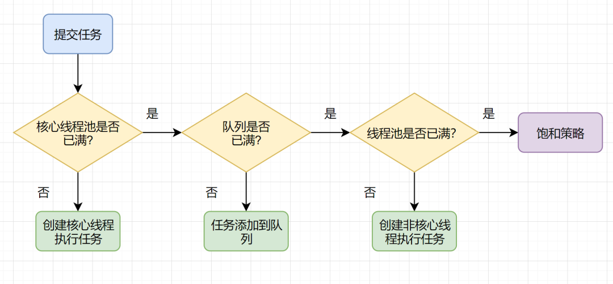

# Thread Pool
简单说，线程池就是存放了很多线程的池子。在对于需要并发处理大量短时任务时，频繁的创建、销毁线程，带来的资源开销和调度开销会影响整体性能。此时可以使用线程池对线程进行统一管理，通过复用降低线程创建和销毁带来的开销，提高响应速度，使任务到达时无需等待线程创建就能立即执行。

## 核心线程
核心线程指常见长期在线程池中存在，不会被销毁的线程。在开辟线程池时，核心线程就被创建，当由任务到达时，将任务交由核心线程去处理，任务完成后，核心线程不会被销毁，而是进入阻塞状态，等待被下个任务唤醒。

## 阻塞队列
若所有核心线程都处于忙碌状态，但此时仍有新的任务需要执行，那么就需要一个任务队列，用于存放等待执行的任务。当核心线程完成任务后，到任务队列里获取等待被执行的任务继续执行。这种任务队列就被成为阻塞队列。

## 非核心线程
当所有核心线程都处于忙碌状态，且任务队列也被占满了以后，就会创建新的线程，用于临时处理大量的任务，称为非核心线程。

## 空闲存活时间
当任务队列被处理完，且空闲达到了一定时间后，非核心线程就会被销毁，这个等待空闲的时间，就是线程空闲存活时间。

## 饱和策略
当核心线程、任务队列、非核心线程全部被沾满以后，此时线程池负载能力达到饱和，若还有新的任务添加，则无法处理任务。通常在这种情况下，有几种处理策略：
- 抛弃任务并抛出异常
- 抛弃任务不抛出异常
- 抛弃阻塞队列最前面的任务，重新尝试执行
- 由调用线程处理该任务
  
## 线程池七大参数
- `CorePoolSize`：核心线程数
- `MaxinumPoolSize`：最大线程数
- `KeepAliveTime`：空闲线程存活时间
- `TimeUnit`：存活时间计量单位
- `BlockingQueue`：线程池任务队列
- `ThreadFactory`：创建线程池的工厂
- `RejectedExecutionHandle`：拒绝策略

## 线程池工作流程

